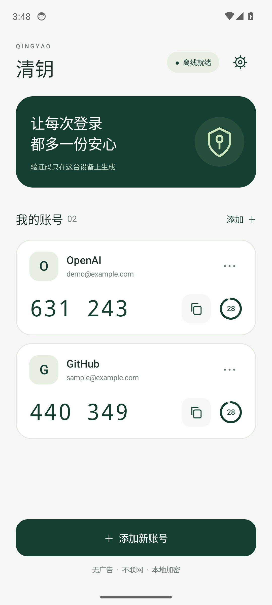

# 清钥 · 安卓身份验证器

一个无广告、无需注册、完全离线的原生安卓身份验证器。适用于 Android 8.0 及以上手机。

**[下载安装包（v1.0.0）](https://github.com/miku88888/qingyao-authenticator/releases/download/v1.0.0/qingyao-1.0.0.apk)** · [备用下载](dist/qingyao-1.0.0.apk?raw=true) · [验证记录](TESTING.md)

## 界面预览

 

预览中为虚构测试账号。首次安装不会预置任何账号。

## 安装和使用

1. 将 `dist/qingyao-1.0.0.apk` 传到手机，点击安装。如果手机询问，请允许此次安装来源。
2. 在需要验证的网站打开「安全 / 两步验证」，选择「身份验证器应用」。
3. 在清钥中选择「扫码添加账号」，对准网站二维码。二维码在手机上时，也可以选择「从图片导入」。
4. 确认账号后，输入清钥显示的 6 位验证码，完成网站绑定。
5. 保存网站提供的恢复代码；在清钥「设置与备份」中导出加密备份。

## 功能

- 相机扫码、二维码图片导入、手动输入 Base32 密钥。
- 标准 TOTP：SHA1 / SHA256 / SHA512，6 位或 8 位，按二维码指定周期刷新。
- 验证码倒计时、一键复制、账号重命名与删除、重复密钥检查。
- 手机设有锁屏密码时，默认在应用回到前台时要求验证；可在设置中关闭。
- 使用 Android Keystore 的 AES-256-GCM 加密本地账号文件，采用原子写入。
- 密码加密备份及恢复合并，使用 PBKDF2-HMAC-SHA256（210,000 次）和 AES-256-GCM。
- 发布版禁止截屏及最近任务中的内容预览；禁用系统自动备份。
- 仅申请相机权限。没有网络权限，没有广告、统计或云同步 SDK。

卸载应用、清除应用数据或手机丢失，会失去本地账号。请先导出备份并妥善保存密码。应用锁保护查看入口，本地数据的加密密钥由 Android Keystore 管理；应用锁不是对每一次加密操作的硬件认证限制。

当前只支持 TOTP；会明确拒绝 HOTP、Google Authenticator 迁移二维码和其他非验证器二维码。二维码图片不会复制到应用存储。请勿将真实绑定密钥写入源码或测试文件。

## 构建

这是原生 Java 安卓项目，可在 Android Studio 中打开。仓库包含不依赖 Gradle 下载的 Windows 构建入口：

```powershell
.\tools\build.ps1 -Sdk 'D:\AndroidDev\sdk' -Jdk 'D:\AndroidDev\jdk'
.\tools\test.ps1 -Jdk 'D:\AndroidDev\jdk'
```

需要 JDK 17、Android SDK Platform 34 和 Build Tools 34.0.0。首次构建下载 ZXing 3.5.4 和 R8 9.5.23；后续可离线构建。源码路径包含中文时，脚本在临时目录创建路径连接以兼容 Windows 安卓工具；实际文件仍保存在本项目中。

发布 APK 自动用项目专属签名签署，签名文件及随机密码位于被忽略的 `.signing/`。**请保留这整个目录**，后续版本需用同一签名才能直接升级并保留账号。不要把签名密码提交到公开仓库。

`-Debug` 用于测试，会允许调试和截图；用户安装包是默认生成的发布版。所有截图使用公开测试密钥，应用首次安装没有预置账号。

## 标准与依赖

- [RFC 6238：TOTP 标准及测试数据](https://www.rfc-editor.org/rfc/rfc6238)
- [Android Keystore 文档](https://developer.android.com/privacy-and-security/keystore)
- [ZXing 3.5.4](https://github.com/zxing/zxing)：Apache License 2.0，许可证见 `THIRD_PARTY_NOTICES.md`。

验证码取决于手机时间。若网站提示错误，请开启手机自动设置日期和时间，并等待下一组验证码。
